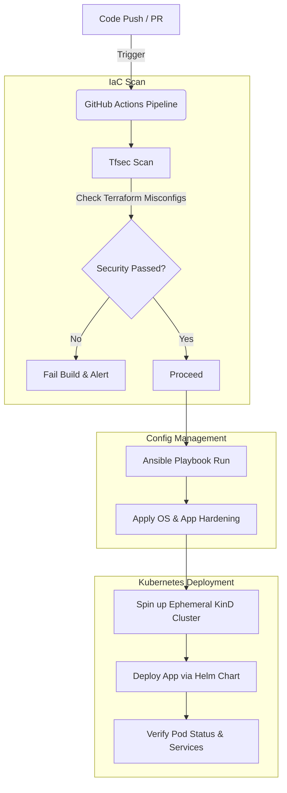

# Enterprise DevSecOps CI/CD Pipeline

[](https://github.com/hazzikri/devsecops-enterprise-project/actions)
[](https://github.com/hazzikri/devsecops-enterprise-project)
[](https://github.com/hazzikri/devsecops-enterprise-project)
[](https://github.com/hazzikri/devsecops-enterprise-project)

An enterprise-grade DevSecOps pipeline demonstrating automated infrastructure provisioning, multi-stage CI/CD security guardrails, configuration management, and cloud-native application orchestration.

---

## 🚀 Architecture Overview

This project establishes a complete shift-left security implementation and automated deployment lifecycle:



1. **Infrastructure as Code (IaC):** Architecture defined locally using Terraform.
2. **Shift-Left Security Scanning:** Automated static analysis using `tfsec` within the CI pipeline to detect infrastructure misconfigurations before deployment.
3. **Configuration Management:** Ansible Playbook integration for automated server hardening and secure audit logging.
4. **Cloud-Native Deployment:** Automated application packaging using Helm and orchestration through Kubernetes, validated on ephemeral KinD clusters.

---

## 🛠️ Technology Stack

* **CI/CD Platform:** GitHub Actions (Multi-Stage Pipelines)
* **Infrastructure Provisioning:** Terraform
* **Security & Compliance:** Aqua Security tfsec
* **Configuration Management:** Ansible
* **Package Management:** Helm v3
* **Container Orchestration:** Kubernetes (KinD & Docker Desktop)
* **Monitoring & Observability:** Gatus & Grafana Enterprise

---

## ⚙️ CI/CD Pipeline Stages

The GitHub Actions workflow (`devsecops.yaml`) automatically runs the following jobs on every push to the `main` branch or pull request:

### 1. IaC Security Scan (`terraform-security`)
* Checks out the Terraform codebase.
* Runs Aqua Security's `tfsec` static analysis.
* Detects insecure configurations (e.g., open security groups, unencrypted resources) and fails the build if security policies are violated.

### 2. Configuration Hardening (`ansible-configuration`)
* Runs an Ansible playbook to hardened servers.
* Automatically provisions a secure audit directory and logs security validation details.

### 3. KinD Cluster Deployment (`helm-kind-deploy`)
* Creates an ephemeral **Kubernetes in Docker (KinD)** cluster inside the GitHub runner.
* Provisions Gatus and Grafana Enterprise services using custom Helm charts.
* Verifies deployment by monitoring Kubernetes pods and cluster services.

---

## 📁 Repository Structure

```
devsecops-enterprise-project/
├── .github/workflows/
│   └── devsecops.yaml          # Multi-stage GitHub Actions CI/CD
├── ansible/
│   └── playbook.yml            # Hardening & audit configuration
├── monitoring-app/
│   ├── templates/              # Kubernetes resource templates (Gatus/Grafana)
│   ├── Chart.yaml              # Helm Chart details
│   └── values.yaml             # Helm value overrides
├── main.tf                     # Local container deployment via Terraform
└── README.md                   # Project documentation
```

---

## 🧪 Local Testing Instructions

### Prerequisites
* Terraform
* Ansible
* Docker & KinD
* Helm v3

### Running Terraform Locally
```bash
terraform init
terraform plan
terraform apply
```

### Running Ansible Hardening Locally
```bash
ansible-playbook ansible/playbook.yml
```

### Running Helm Deployment Locally
```bash
# Create kind cluster
kind create cluster --name devsecops-cluster

# Deploy helm chart
helm install devsecops ./monitoring-app --values ./monitoring-app/values.yaml

# Verify deployment
kubectl get pods -A
```
